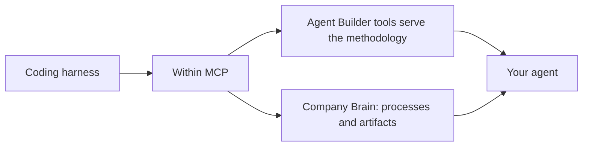

This track is for developers and AI platform teams. You work in the coding harness your engineers already use, such as [Codex](/install/codex), [Claude Code](/install/claude-code), or the [Gemini CLI](/install/gemini-cli), and build compound agents at the code level.

The non-technical track builds skills and simple agents. This track builds the compound ones.

## The Agent Development Kit

The Agent Development Kit (ADK) defines the build sequence from a business objective to a tested, deployed agent. Each stage uses current [Company Brain](/concepts/process-index) evidence where the process is relevant to the decision.

<Note>
  You do not install a separate ADK package. The method is served through the MCP. Once Within is connected in your harness, the assistant calls [`get_agent_builder_instructions`](/tools/agent-builder) and follows the returned method, retrieving the supporting resources it names.
</Note>

Because the method is served at build time, start each new build by retrieving the current instructions. Version the code, configuration, evaluations, and evidence baseline that the build produces in your own repository.



## The sequence

The assistant guides the sequence and produces the build artifacts in your harness. Your team supplies the objective, constraints, approvals, and technical judgment. Company Brain evidence grounds process claims, but it does not replace security review, system documentation, or runtime testing.

The prompts below are what a builder types in their harness with Within connected.

<Steps>
  <Step title="Objective">
    Define the business objective and the technology stack the solution should live within. Giving both the goal and the stack constraints up front makes recommendations far more useful and deployable.

    ```text
    I want to optimize order-to-cash on AWS Bedrock with the Claude Agent SDK.
    Help me frame the objective and constraints.
    ```

    See [Set the objective](/transformation/objective) for what a well-formed one looks like.
  </Step>

  <Step title="Companion">
    Make sure the Company Brain covers the area in question. Where coverage is thin, deploy [Companion](/concepts/discover-structure-improve) against it before building.

    ```text
    Does our Company Brain have enough coverage of accounts payable to build
    against? Where is it thin?
    ```
  </Step>

  <Step title="Analyze">
    Produce a current-state read from observed data: pain points, bottlenecks, time and motion, systems in use, and bright spots.

    ```text
    Give me a current-state read of procure-to-pay: pain points, bottlenecks,
    time-and-motion, systems, and bright spots.
    ```
  </Step>

  <Step title="Recommend and select">
    Generate candidate use cases and screen them against evidence, expected impact, feasibility, and required controls.

    ```text
    Find automation opportunities in this process, rank them by evidence and
    expected impact, and flag which are feasible to ship now.
    ```

    Apply the screens in [Pick the right use case](/transformation/use-case-selection). The [Find transformation opportunities](/guides/find-opportunities) guide covers the tool chain behind this step.
  </Step>

  <Step title="Design">
    Produce the agent specification, effectively a PRD for the agent: scope, governance, credentials, and flow.

    ```text
    Spec this out: what should the invoice-exception agent do, which tools and
    credentials, and where are the human approval points?
    ```
  </Step>

  <Step title="Build">
    Generate the agent: code, skills, and configuration.

    ```text
    Build it. Generate the agent against this spec.
    ```
  </Step>

  <Step title="Test">
    Generate and run evaluations before release. Include ordinary cases, edge cases, malformed or missing inputs, and requests the agent should refuse.

    ```text
    Test this. Generate an eval suite with edge cases and should-not-fire cases,
    run it against approved test data, and report the evidence for each result.
    ```
  </Step>

  <Step title="Deploy">
    Ship into your environment.

    ```text
    Deploy this. Set it up as a Managed Agent in our environment.
    ```
  </Step>
</Steps>

## What you build

Compound agents, managed, orchestrated, or custom SDK-built, and deterministic Integration Flows. See [What you can build](/transformation/what-you-can-build) for how the primitives differ and when each one fits.

Two controls run throughout. Material process claims cite observed data, and a person approves the design and release gates.

## Artifacts are part of the value

The current-state read and recommendation can be generated as visual HTML artifacts. Use them to review the evidence, assumptions, controls, and proposed change with stakeholders before implementation.

## Keeping agents current

An agent can drift as the process changes. See [Keep agents current](/transformation/maintain-agents) for how to compare an existing build with current Company Brain evidence and decide what needs to be retested.

## Within support

Within's team can work with your engineers on implementation, production readiness, and evaluation design.

## Related

<Columns cols={2}>
  <Card title="Agent Builder tools" icon="screwdriver-wrench" href="/tools/agent-builder">
    The two tools that serve the methodology.
  </Card>
  <Card title="Build skills, agents, and automations" icon="wand-magic-sparkles" href="/guides/agent-builder">
    The same flow from any MCP client, not just a coding harness.
  </Card>
</Columns>
