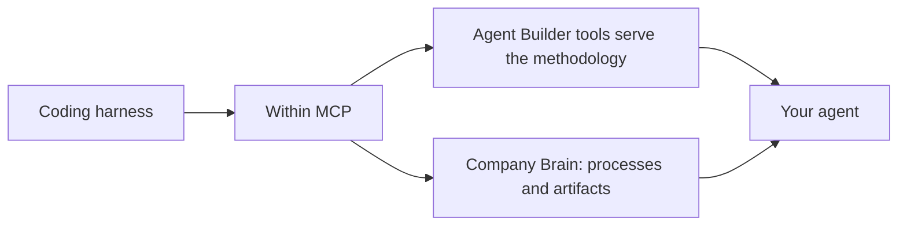

This track is for technical builders, a developer or your AI Center of Excellence. What makes it distinct isn't a single tool. It's that you work in the coding harness your engineers already use, [Codex](/install/codex), [Claude Code](/install/claude-code), or the [Gemini CLI](/install/gemini-cli), iterating at the code level to build compound agents.

The non-technical track builds skills and simple agents. This track builds the compound ones.

## The Agent Development Kit

The Agent Development Kit (ADK) is the throughline. It's a disciplined sequence that runs from a business objective to a tested, deployed agent, grounded at every step in your [Company Brain](/concepts/process-index) rather than guesswork.

<Note>
  There is nothing separate to install. The ADK methodology is served from the MCP itself. Once Within is connected in your harness, ask your assistant to build something and it calls [`get_agent_builder_instructions`](/tools/agent-builder), then follows what comes back, fetching supporting material with `get_agent_builder_resource` as it needs it.
</Note>

That has a practical consequence worth knowing. There is no plugin version to track and nothing to keep updated. The methodology your assistant follows is whatever the MCP is serving right now, so improvements reach you the next time you build.



## The sequence

At every step the assistant can do the work, or your team can do it themselves. The ADK brings rigor and speed. The Company Brain is what unleashes it, because every step is grounded in observed work.

The prompts below are what a builder types in their harness with Within connected.

<Steps>
  <Step title="Objective">
    Define the business objective and the technology stack the solution should live within. Giving both the goal and the stack constraints up front makes recommendations far more useful and deployable.

    ```text
    I want to optimize order-to-cash on AWS Bedrock with the Claude Agent SDK.
    Help me frame the objective and constraints.
    ```

    See [Set the objective](/transformation/objective) for what a well-formed one looks like.
  </Step>

  <Step title="Companion">
    Make sure the Company Brain covers the area in question. Where coverage is thin, deploy [Companion](/concepts/discover-structure-improve) against it before building.

    ```text
    Does our Company Brain have enough coverage of accounts payable to build
    against? Where is it thin?
    ```
  </Step>

  <Step title="Analyze">
    Produce a current-state read from observed data: pain points, bottlenecks, time and motion, systems in use, and bright spots.

    ```text
    Give me a current-state read of procure-to-pay: pain points, bottlenecks,
    time-and-motion, systems, and bright spots.
    ```
  </Step>

  <Step title="Recommend and select">
    Generate candidate use cases and screen them down to the highest-leverage one that is feasible now.

    ```text
    Find the highest-leverage automation opportunities in this process, rank
    them, and flag which are feasible to ship now.
    ```

    Apply the screens in [Pick the right use case](/transformation/use-case-selection). The [Find transformation opportunities](/guides/find-opportunities) guide covers the tool chain behind this step.
  </Step>

  <Step title="Design">
    Produce the agent specification, effectively a PRD for the agent: scope, governance, credentials, and flow.

    ```text
    Spec this out: what should the invoice-exception agent do, which tools and
    credentials, and where are the human approval points?
    ```
  </Step>

  <Step title="Build">
    Generate the agent: code, skills, and configuration.

    ```text
    Build it. Generate the agent against this spec.
    ```
  </Step>

  <Step title="Test">
    Generate and run evaluations. This is the hard but essential work of putting an agent through its paces before it ships.

    ```text
    Test this. Generate an eval suite with edge cases and should-not-fire cases,
    run it against real data, and ship on pass.
    ```
  </Step>

  <Step title="Deploy">
    Ship into your environment.

    ```text
    Deploy this. Set it up as a Managed Agent in our environment.
    ```
  </Step>
</Steps>

## What you build

Compound agents, managed, orchestrated, or custom SDK-built, and deterministic Integration Flows. See [What you can build](/transformation/what-you-can-build) for how the primitives differ and when each one fits.

Two disciplines run throughout. Every recommendation cites observed data, and a human signs off at each step.

## Artifacts are part of the value

The current-state reads and recommendations come out as clear, visual HTML artifacts. The assistant generates them as it works. Showing these to non-technical stakeholders is one of the best ways to win business buy-in for a build.

## Keeping agents current

An agent built against last quarter's process drifts as the business changes. See [Keep agents current](/transformation/maintain-agents) for how to diff a repository of existing agents against the Company Brain and refresh what has moved.

## Within support

Within's FDEs can work alongside your engineers to build the agents, get them into production, and define the test and eval suites.

## Related

<Columns cols={2}>
  <Card title="Agent Builder tools" icon="screwdriver-wrench" href="/tools/agent-builder">
    The two tools that serve the methodology.
  </Card>
  <Card title="Build skills, agents, and automations" icon="wand-magic-sparkles" href="/guides/agent-builder">
    The same flow from any MCP client, not just a coding harness.
  </Card>
</Columns>
